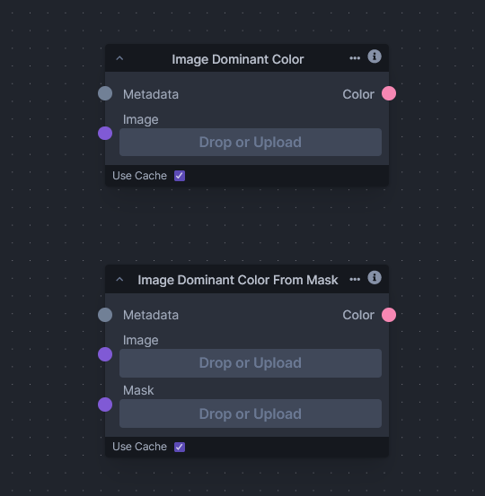

# Image Dominant ColorInfo

The "Image Dominant Color" node is a straightforward tool that employs clustering techniques to identify the dominant color within an image. The primary use of this node is to extract the most representative color of the image, which can be particularly useful for tasks such as theme generation, palette creation, or brand color identification.

The core of the node is a k-means clustering algorithm, which is applied to the colors of the image represented in the HSV (Hue, Saturation, Value) color space.

In this node, the k-means algorithm is configured to find a single cluster center – effectively the “average” color, although in a color space, this would be understood as the color that minimizes the distance to all others. Once the algorithm converges, the resulting cluster center is taken as the dominant color.

The outcome is a simple but effective approximation of the color that most stands out in the image, and while the process doesn't guarantee a perfect match for human perception (since it doesn't account for complex factors like texture and context), it provides a quick and automated estimation of a key visual element within the image.
